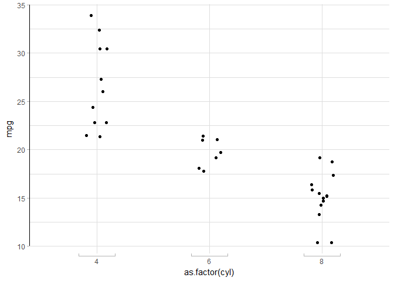

<!-- README.md is generated from README.Rmd. Please edit that file -->
Lemon --- yet another ggplot2 extension package
===============================================

Just another [ggplot2](http://ggplot2.tidyverse.org) and [knitr](https://yihui.name/knitr/) extension package.

This package contains functions primarily in these domains of ggplot2:

-    Axis lines
-    Repeated axis lines on facets.
-   Legends
-   knitr

Installation
------------

``` r
# install.packages("devtools")

# Install release from GitHub:
devtools::install_github("stefanedwards/lemon", ref='v0.2')

# Or get the lastest development version from GitHub:
devtools::install_github("stefanedwards/lemon")
```

Usage
-----

We can display a limit on the axes range.

``` r
<<<<<<< HEAD
library(lemon)
ggplot(mtcars, aes(x=cyl, y=mpg)) + 
  geom_point() + 
  coord_capped_cart(bottom='both', left='none') +
  theme_light() + theme(panel.border=element_blank(), axis.line = element_line())
```


**NB**: Disable `panel.border` and enable `axis.line` in `theme`, otherwise you will not see an effect!

We could also show that the x-axis is categorical (or ordinal):

``` r
ggplot(mtcars, aes(x=as.factor(cyl), y=mpg)) + 
  geom_point(position=position_jitter(width=0.1)) + 
  coord_flex_cart(bottom=brackets_horisontal(), left=capped_vertical('none')) +
  theme_light() + theme(panel.border=element_blank(), axis.line = element_line())
```



Legends
-------

Reposition the legend onto the plot. Exactly where you want it:

``` r
dsamp <- diamonds[sample(nrow(diamonds), 1000), ]
d <- ggplot(dsamp, aes(carat, price)) +
  geom_point(aes(colour = clarity))
reposition_legend(d, 'top left')
```


Scavenging the Internet, we have found some functions that help work with legends.

Frequently appearing on [Stack Overflow](http://stackoverflow.com), we bring you `g_legend`:

``` r
library(grid)
legend <- g_legend(d)
grid.newpage()
grid.draw(legend)
```


[Shaun Jackman](http://rpubs.com/sjackman) [originally](%5Bhttp://rpubs.com/sjackman/grid_arrange_shared_legend) brought us the `grid_arrange_shared_legend`, which was furhter refined by `baptiste` ([original](https://github.com/tidyverse/ggplot2/wiki/Share-a-legend-between-two-ggplot2-graphs)). We put it in a package.

``` r
dsamp <- diamonds[sample(nrow(diamonds), 1000), ]
p1 <- qplot(carat, price, data = dsamp, colour = clarity)
p2 <- qplot(cut, price, data = dsamp, colour = clarity)
p3 <- qplot(color, price, data = dsamp, colour = clarity)
p4 <- qplot(depth, price, data = dsamp, colour = clarity)
grid_arrange_shared_legend(p1, p2, p3, p4, ncol = 2, nrow = 2)
```


Extensions to knitr
-------------------

We automatically load knitr's `knit_print` for data frames and dplyr tables to provide automatic pretty printing of these using `kable`:

Before loading `splot` package:

``` r
data(USArrests)
head(USArrests)
#>            Murder Assault UrbanPop Rape
#> Alabama      13.2     236       58 21.2
#> Alaska       10.0     263       48 44.5
#> Arizona       8.1     294       80 31.0
#> Arkansas      8.8     190       50 19.5
#> California    9.0     276       91 40.6
#> Colorado      7.9     204       78 38.7
```

After loading `splot`:

``` r
head(USArrests)
```

|            |  Murder|  Assault|  UrbanPop|  Rape|
|------------|-------:|--------:|---------:|-----:|
| Alabama    |    13.2|      236|        58|  21.2|
| Alaska     |    10.0|      263|        48|  44.5|
| Arizona    |     8.1|      294|        80|  31.0|
| Arkansas   |     8.8|      190|        50|  19.5|
| California |     9.0|      276|        91|  40.6|
| Colorado   |     7.9|      204|        78|  38.7|

See `knit_print.data.frame`.

To do:
------

-   Describe coord objects in capped-axes vignette.
-   Add `.dot` functions to knitr.

